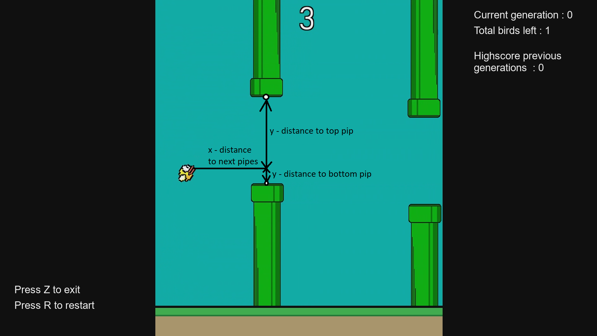

# flappy_bird_evolutionary_NN

This is a gamemaker project, in which I made a simple Flappy Bird clone in which a flock of birds play the game at the same time, each with their own fully-connected Dense Neural Network. Everytime all the birds die, the best ones reproduce, some of the birds mutate and the process starts again. After a few generations of birds crashing into pipes, some birds will emerge which can play Flappy Bird without the need for player input. 

The neural networks used consist of fully-connected, dense layers with tanh activation functions. The input consists of an array of 4 values, the horizontal distance to the next pipe, the vertical speed of the bird, the vertical distance to the next top pipe and the vertical distance to the next bottom pipe. Each value has been normalized between [0,1]. There is a single output node, which results in the bird flapping or not flapping.

The fitness score with which the birds were ranked was calculated as follows : 
Number_of_steps_the_bird_survived + 200 * (1- abs(y_coordinate_next_pipe - y_coordinate_bird)/room_height). 

The best birds over all the generations were kept in the freezer and directly cloned into each next generation, to prevent complete wipe out of the generation due to unlucky generation of the pipes. These birds are shown with a red outline.

Feel free to use any of the code for neural networks in Gamemaker, which are under scripts/scr_NN_functions. The code can be repurposed with relative ease to use in other Evolutionary Neural Network projects (think classic Atari games or games with simple inputs/outputs like flappy bird). It should be noted that doing this in Gamemaker is not entirely efficient, so if you want to run the simulation for large projects (1000s of agents playing the same game) you are better of using Python/pygame or equivalent in C++ (Unity also has pretty good machine learning options).

Thanks for reading, keep doing awesome things!
